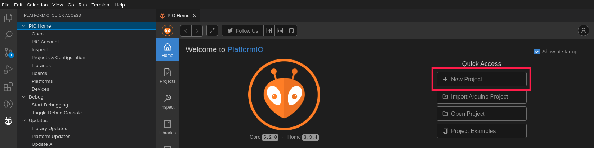
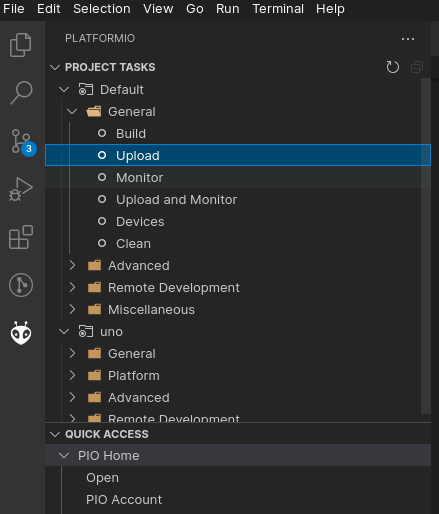
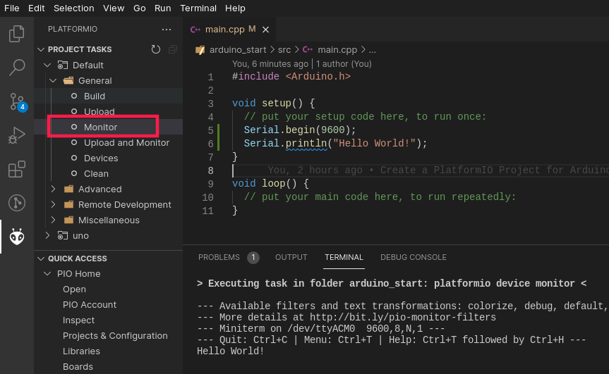

# Getting Started with Arduino in Linux

A getting started project for programming Arduino Uno board in Linux.

## 1. Instal VSCode

https://code.visualstudio.com/

## 2. Install PlatformIO

Install PlatformIO IDE for VSCode:

[Getting Started with PlatformIO](https://dronebotworkshop.com/platformio/)

VSCode Extension:

https://marketplace.visualstudio.com/items?itemName=platformio.platformio-ide


## 3. Create a PlatformIO Project for Arduino

- Create a New Project



- Configure it for Arduino Uno


## 4. Write your code

Open `arduino_start/src/main.cpp` and write your code:


## 5. Upload it to board

### 5.1. Access to Serial Port

In order to upload the compiled program to your board you should have access to serial ports. This is done by adding your user to `dialout` and `tty` groups:

```console
sudo usermod -a -G dialout $USER
sudo usermod -a -G tty $USER
```

You can verify if your user is added to `dialout` and `tty` groups using this command:

```console
groups $USER
```

Note: You should log out and log in or reboot your computer in order to this configurations take place.

### 5.2 Upload

Upload your program to Arduino Uno:



### 5.3 Monitor Serial Port

You can access a serial port and monitor it in Terminal of VSCode using PlatformIO:

